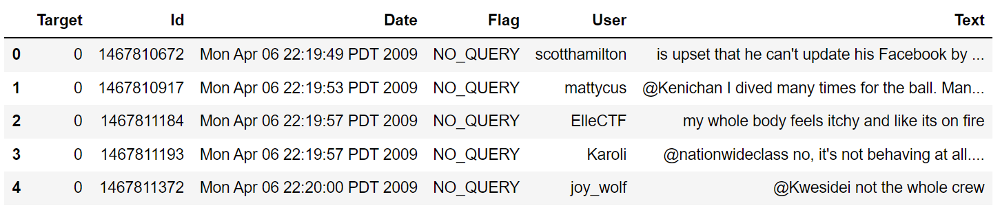
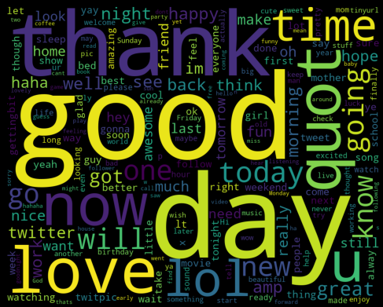
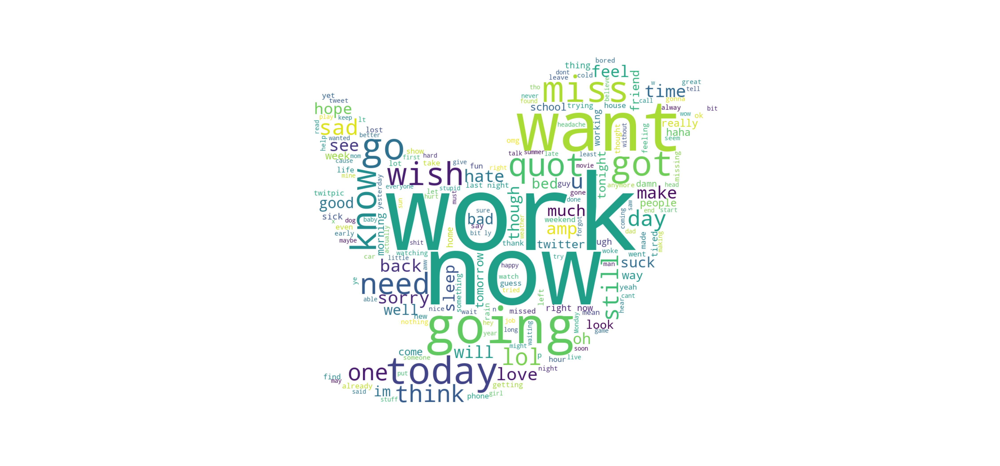

# Facilitating-Sentiment-Analysis-of-Twitter-Data


# Sentiment Analysis


## Table of Content:

1. [Overview](#overview)
2. [Motivation](#motivation)
3. [Data](#data)
4. [Dependency](#dependency) 
5. [Result](#result)

## Overview

With the increasing use of social media sites, a large amount of data has been generated from these sites. A huge number of users share lots of tweets and information related to current topics and opinions every day. Sentiment analysis of Twitter can be used as a quick and easy tool to track public perceptions about an organization’s brand, business and other topics. Twitter has a short message system that leads to the use of informal words to express the feeling or emotions for specific topics. Because of this, an improvement in the process of analyzing Twitter data must be done. In this study, I have decided to implement a supervised machine learning approach with the consideration of semantic features of tweets. This feature connects an entity with its semantic concept. Additionally, this study also reveals the accuracy difference for two conditions: considering stop-words and emoticons, removing the stop-words and emoticons.

## Motivation

Considering the increasing demand of social media giants, the importance of the information shared on that platforms is getting increasing day by day. In the last few years, Twitter has outshined all other microblogging services in terms of popularity. As per the current [report of Q1](https://www.businessofapps.com/data/twitter-statistics/) 2021, it has 199 million average daily active users. And it has an average of [500 million](https://www.oberlo.in/blog/twitter-statistics) tweets per day. So, Twitter has become a great source of information to analyze the review on a particular topic, event, or product. Twitter has a large number of reputed accounts which share informative tweets and users are giving their sentiment by replying to tweets. Due to a large amount of data, manual inspection of each tweet is getting harder. So the proposed approach can eliminate the manual analysis of sentiment of Twitter data. 

## Data

To experiment the model I have considered **"Sentiment140 dataset with 1.6 million tweets"** dataset which is publicly available on _**Kaggle**_.

Link: https://www.kaggle.com/kazanova/sentiment140

Dataset has contains following 6 fields:

1. **target**: Polarity of the tweet (*0* = negative, *2* = neutral, *4* = positive)
2. **ids**: Id of the tweet
3. **date**: Creation date of the tweet
4. **flag**: Query (*lyx*). If there is no query, then this value is NO_QUERY.
5. **user**: User that tweeted (*robotickilldozr*)
6. **text**: Text or Body of the tweet (*Lyx is cool*)

## Dataset Sample:



**Word cloud of Positive Tweets**



**Word cloud of Negative Tweets**




# Dependency

This project is built in Python. Mentioned below are the required libraries:

```
import numpy as np 
import pandas as pd 
import os
```

``` 
import matplotlib.pyplot as plt
import seaborn as sns

import re
import nltk
from nltk.corpus import stopwords
from nltk.stem.porter import PorterStemmer
from nltk.tokenize import word_tokenize, sent_tokenize
from nltk.stem.wordnet import WordNetLemmatizer
import string

from sklearn.model_selection import train_test_split
from sklearn.model_selection import cross_val_score, GridSearchCV
from sklearn.metrics import confusion_matrix, classification_report, accuracy_score, f1_score
from sklearn.naive_bayes import MultinomialNB
from sklearn.feature_extraction.text import CountVectorizer, TfidfTransformer
from sklearn.pipeline import Pipeline
```


# Result 


# note:

#- for heading 

Shift + enter- newline

_ _ - Italic

** ** - Bold

_ ** ** _  - bold and italic

~~ ~~ - strike threw

:p: - emoji

##- subheading

''' - embedding code

[" "]  (link) -     link

Image: 

​		![python] (url)

​		![python] (path)	

List:

table of content:

1. [style] (#style-examples)


Shields.io - For badges

