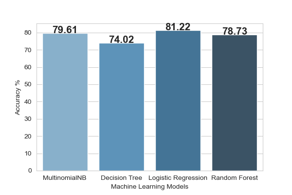

# Facilitating-Sentiment-Analysis-of-Twitter-Data

Author: Brij Patel

 

# Sentiment Analysis


## Table of Content:

1. [Overview](#overview)
2. [Motivation](#motivation)
3. [Methodology](#methodology)
4. [Data](#data)
5. [Installation](#intallation)
6. [Libraries Imported](#libraries-imported) 
7. [Result](#result)
8. [Road-map](#Road-map)


## Overview

With the increasing use of social media sites, a large amount of data has been generated from these sites. A huge number of users share lots of tweets and information related to current topics and opinions every day. Sentiment analysis of Twitter can be used as a quick and easy tool to track public perceptions about an organization's brand, business, and other topics. Twitter has a short message system that leads to the use of informal words to express the feeling or emotions for specific topics. In this study, I have decided to implement a supervised machine learning approach with the consideration of lexical dataset WordNet to lemmatize the words which can increase the accuracy of the sentiment analysis process. Additionally, this study also reveals the importance of the Stop-words in the analysis process. Rather than only considering the common practice of pre-processing task which is to remove the stop-words step, I have made two different models to check the performance and the accuracy of two made models. Finally, I have measured the performance of the classifier in the terms of precision, recall, f1-score and accuracy.


## Motivation

Considering the increasing demand of social media giants, the importance of the information shared on that platforms is getting increasing day by day. In the last few years, Twitter has outshined all other microblogging services in terms of popularity. As per the current [report of Q1](https://www.businessofapps.com/data/twitter-statistics/) 2021, it has 199 million average daily active users. And it has an average of [500 million](https://www.oberlo.in/blog/twitter-statistics) tweets per day. So, Twitter has become a great source of information to analyze the review on a particular topic, event, or product. Twitter has a large number of reputed accounts which share informative tweets and users are giving their sentiment by replying to tweets. Due to a large amount of data, manual inspection of each tweet is getting harder. So the proposed approach can eliminate the manual analysis of sentiment of Twitter data. 


## Methodology

* I have implemented sentiment analysis model with supervised machine learning model.
* Firstly, I have gathered data from Kaggle dataset then pre-processed the data for cleaning the document to get better accuracy.
* I have made 2 different model to check the importance of stop-words in the analysis process.
* For classification task, I have implemented 4 different classification techniques to check the best outcome of the model in which I have used Multinomial Naive Byes, Decision tree, Logistic regression and Random forest.
* Result have been evaluated by the values of Precession, Recall, F1-score and accuracy. 


## Data

To experiment the model I have considered **"Sentiment140 dataset with 1.6 million tweets"** dataset which is publicly available on _**Kaggle**_.

Link: https://www.kaggle.com/kazanova/sentiment140

Dataset has contains following 6 fields:

1. **target**: Polarity of the tweet (*0* = negative, *2* = neutral, *4* = positive)
2. **ids**: Id of the tweet
3. **date**: Creation date of the tweet
4. **flag**: Query (*lyx*). If there is no query, then this value is NO_QUERY.
5. **user**: User that tweeted (*robotickilldozr*)
6. **text**: Text or Body of the tweet (*Lyx is cool*)

## Dataset Sample:


**Word cloud of Positive Tweets**


**Word cloud of Negative Tweets**


## Installation

I have completed my whole project in jupyter which is available on the internet and anyone can run this project in jupyter.

For the installation of jupyter notebook, [click hear](https://test-jupyter.readthedocs.io/en/latest/install.html) and follow the instruction stated below:

**Installing jupyter by anaconda**

* Download Anaconda 

* Install anaconda

* Run the notebook in command line

  ```
  jupyter notebook
  ```

**Installing jupyter by pip**

* For existing python user jupyter can be installed by pip. Firstly, upgrade pip by following command:

  ``` 
  pip3 install --upgrade pip
  ```

* Install jupyter notebook

  ```
  pip3 install jupyter
  ```

  

## Libraries Imported

**Installation Packages:**

```python
pip install wordcloud
pip install tweepy
pip install -U textblob
```

**This project is built in Jupyter Notebook. Mentioned below are the required libraries:**

```python
import numpy as np 
import pandas as pd 
import os
```
```python
import re
import string
import tweepy
from PIL import Image
from textblob import TextBlob
import matplotlib.pyplot as plt
import seaborn as sns
from wordcloud import WordCloud, STOPWORDS
```


``` python
import nltk
from nltk.corpus import stopwords
from nltk.stem.porter import PorterStemmer
from nltk.tokenize import word_tokenize, sent_tokenize
from nltk.stem.wordnet import WordNetLemmatizer
```

```python
from sklearn.model_selection import train_test_split
from sklearn.model_selection import cross_val_score, GridSearchCV
from sklearn.metrics import confusion_matrix, classification_report, accuracy_score, f1_score
from sklearn.naive_bayes import MultinomialNB
from sklearn.tree import DecisionTreeClassifier
from sklearn.linear_model import LogisticRegression
from sklearn.ensemble import RandomForestClassifier
from sklearn.feature_extraction.text import CountVectorizer, TfidfTransformer
from sklearn.pipeline import Pipeline
```


## Result 

I have implemented this model by using 4 different machine learning techniques and evaluate the result of each. And also implemented 2 different models one is with consideration of stop-words removing task and another is without removing stop-words. The results of both models can be identified as below which stated that without removing stop-words can give better accuracy.

**Sentiment Analysis - Removing Stop Words**



**Sentiment Analysis - With Stop Words**


More detailed results can be found in code and different result's tables are available in [Images](Images) section of repository.


## Road-map

* In the future, I would like to add emoticons analysis in this project because emoticons can identify the overall sentiment of the tweet.
* I will also implement semantic concept in the sentiment analysis process that can help companies to evaluate overall sentiment of brand rather than only accounting a product.


## Note

I have implemented this model by my own with taking reference of Github repository.

[Sentimental_Semantic_Analysis](https://github.com/Nikhil612/Sentimental_Semantic_Analysis)


## Contact 

Please contact me if you have any suggestion or any query regarding to project.

Email: [Brij Patel](mailto:bpatel34@lakeheadu.ca?subject=[GitHub]%20Source%20Han%20Sans) [:email:](mailto:bpatel34@lakeheadu.ca?subject=[GitHub]%20Source%20Han%20Sans)

